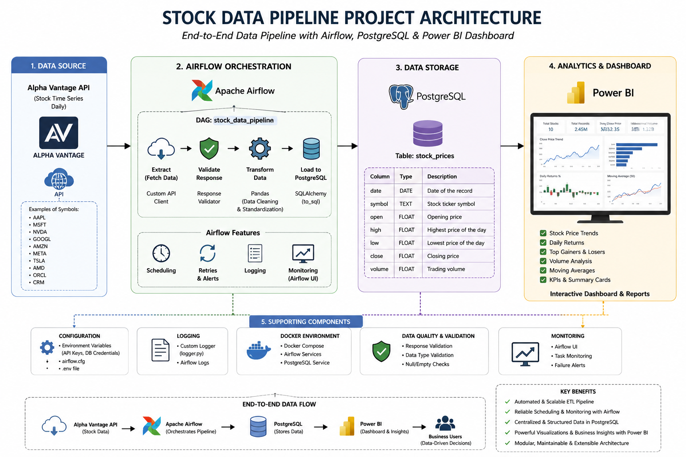

# 📈 Stock Data Pipeline with Airflow, Postgres & Analytics

An end-to-end data engineering project that extracts daily stock market data from an external API, processes it using Python, orchestrates workflows with Apache Airflow, and stores cleaned data in PostgreSQL for analytics and dashboarding.

---


## Project Overview

This project builds an automated ETL pipeline that:

- Fetches daily stock price data from an external API
- Validates and transforms raw API responses
- Loads structured data into a PostgreSQL database
- Automates ingestion using Apache Airflow DAGs
- Enables downstream analytics via BI tools (Power BI / Tableau / Streamlit)

---

## 🏗️ Architecture

The pipeline follows a modern data engineering workflow:

1. **Data Source** → Alpha Vantage / Yahoo Finance API  
2. **Ingestion Layer** → Python API client  
3. **Validation Layer** → Response validation & error handling  
4. **Transformation Layer** → Pandas data cleaning & formatting  
5. **Orchestration** → Apache Airflow DAG  
6. **Storage Layer** → PostgreSQL (`stock_prices` table)  
7. **Analytics Layer** → Power BI / Tableau / Streamlit dashboards  

---

## 🧰 Tech Stack

- **Python** – Data ingestion & transformation
- **Apache Airflow** – Workflow orchestration
- **PostgreSQL** – Data storage
- **Pandas** – Data processing
- **SQLAlchemy** – Database connection
- **Docker** – Containerized environment
- **APIs** – Alpha Vantage

---

## ▶️ How to Run

### 1. Clone the repository
```bash
git clone <repo-url>
cd stock_pipeline_project
2. Start Airflow with Docker
docker compose up -d
3. Access Airflow UI
http://localhost:8080
4. Trigger DAG
Open stock_pipeline_dag
Click Trigger DAG

Built by Paulet as a data engineering portfolio project demonstrating:

ETL pipeline design
API integration
Workflow orchestration
Data warehousing

---